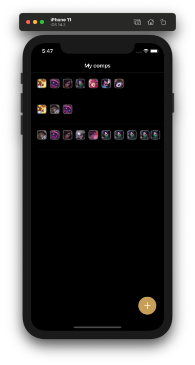
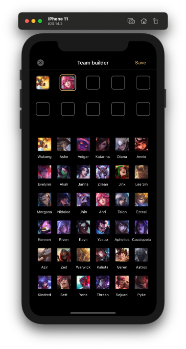

# TacterApp
Technical test for Tacter App Startup.

iOS project developed with *Swift 5* + *MVVM pattern* + *No Storyboards* + *Core Data* as Local storage.

## Screenshots

## How to run the project ?
* Download the zip file or clone the project, currently there's one master branch.
* Run the project using Xcode( change the bundle identifier, if you want to run it on your device).

## Having trouble ?
* If you are having trouble with this project or if you find any bugs, do open a new issue and describe the problem.
* Alternatively, you can drop me a mail @ oscar.garrucho@gmail.com

## Spread the word!
Liked the project? Just give it a star ⭐️ and spread the word!

## Credits
**© Óscar R. Garrucho | 2020**

Visit my blog for more info: [www.oscargarrucho.com](http://www.oscargarrucho.com/)

## MIT License

Copyright (c) 2018 Chester How

Permission is hereby granted, free of charge, to any person obtaining a copy of this software and associated documentation files (the "Software"), to deal in the Software without restriction, including without limitation the rights to use, copy, modify, merge, publish, distribute, sublicense, and/or sell copies of the Software, and to permit persons to whom the Software is furnished to do so, subject to the following conditions:

The above copyright notice and this permission notice shall be included in all copies or substantial portions of the Software.

THE SOFTWARE IS PROVIDED "AS IS", WITHOUT WARRANTY OF ANY KIND, EXPRESS OR IMPLIED, INCLUDING BUT NOT LIMITED TO THE WARRANTIES OF MERCHANTABILITY, FITNESS FOR A PARTICULAR PURPOSE AND NONINFRINGEMENT. IN NO EVENT SHALL THE AUTHORS OR COPYRIGHT HOLDERS BE LIABLE FOR ANY CLAIM, DAMAGES OR OTHER LIABILITY, WHETHER IN AN ACTION OF CONTRACT, TORT OR OTHERWISE, ARISING FROM, OUT OF OR IN CONNECTION WITH THE SOFTWARE OR THE USE OR OTHER DEALINGS IN THE SOFTWARE.

